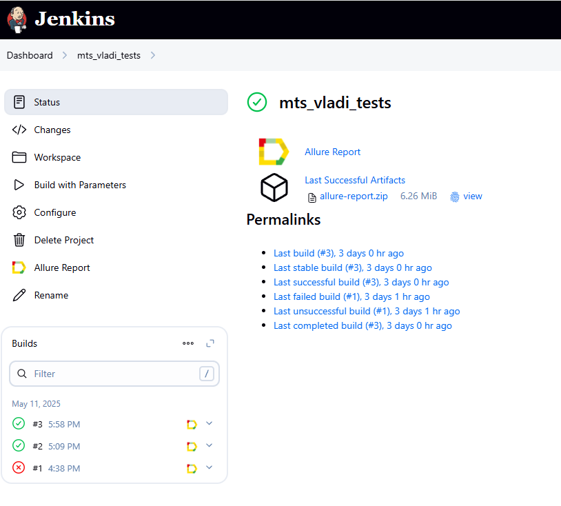
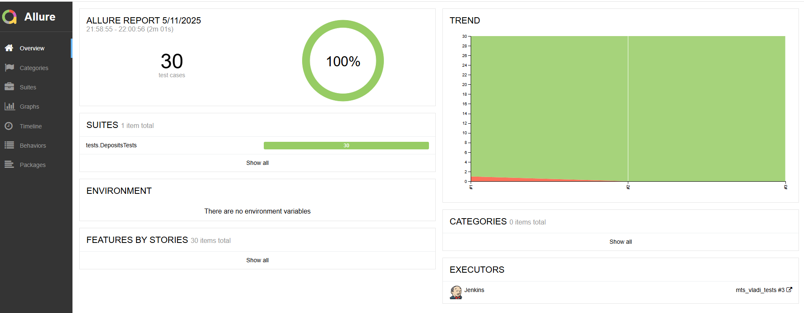

<a href="https://www.wildberries.ru">  
<h1>Проект по автоматизации тестирования для <a href="https://www.wildberries.ru">Wildberries</a></h1>

## ☑️ Содержание:

- Технологии и инструменты
- Список проверок, реализованных в тестах
- Запуск тестов (сборка в Jenkins)
- Allure-отчет
- Уведомление в Telegram о результатах прогона
- Видео пример прохождения тестов

<a id="tools"></a>
## :ballot_box_with_check: Технологии и инструменты:

|                                               Java                                                |                                              IntelliJ Idea                                              |                                               GitHub                                                |                                                  JUnit 5                                                   |                                               Gradle                                                | Selenide | Selenoid | Allure Report | Jenkins | Telegram |
|:-------------------------------------------------------------------------------------------------:|:-------------------------------------------------------------------------------------------------------:|:---------------------------------------------------------------------------------------------------:|:----------------------------------------------------------------------------------------------------------:|:---------------------------------------------------------------------------------------------------:|:--------:|:--------:|:-------------:|:-------:|:--------:|
| <a href="https://www.java.com/"></a> | <a href="https://www.jetbrains.com/idea/"></a> | <a href="https://github.com/"></a> | <a href="https://junit.org/junit5/"></a> | <a href="https://gradle.org/"></a> | <a href="https://selenide.org/"></a> | <a href="https://aerokube.com/selenoid/"></a> | <a href="https://github.com/allure-framework"></a> | <a href="https://www.jenkins.io/"></a> | <a href="https://web.telegram.org/"></a> |

<a id="cases"></a>
## :ballot_box_with_check: Реализованные проверки:

- Проверка успешного добавления товара в корзину
- Проверка успешного удаления товара из корзины
- Проверка возможности поиска по картинки
- Проверка поиска несуществующего товара
- Проверка увеличения счетчика товара
- Проверка уменьшения счетчика товара

##  Сборка в Jenkins

<p align="center">  
  
</p>

## :ballot_box_with_check: Параметры сборки в Jenkins:

- browser (браузер, по умолчанию chrome)
- browserVersion (версия браузера, по умолчанию 120.0)
- browserSize (размер окна браузера, по умолчанию 1920x1080)
- remoteUrl (URL для удаленного запуска)

## Команда для запуска из терминала
Локальный запуск
```bash
gradle clean wb_tests
```
Запуск с параметрами:
```bash  
-Dbrowser=chrome -DbrowserSize=1920x1080 -DbrowserVersion=128.0
```
Удаленный запуск через Jenkins:
```bash  
clean mts_tests
-Dbrowser="${BROWSER}"
-DbrowserSize="${BROWSER_SIZE}"
-DbrowserVersion="${BROWSER_VERSION}"
-DbrowserRemote="https://log:pass@${BROWSER_REMOTE}/wd/hub"
```

## </a>  <a name="Allure"></a>Allure Report	</a>


## Основная страница отчёта

<p align="center">  
  
</p>  

____
## </a> Уведомление в Telegram при помощи бота
____
<p align="center">  
  
</p>

____
## </a> Примеры видео выполнения тестов на Selenoid
____
<p align="center">
   
</p>
